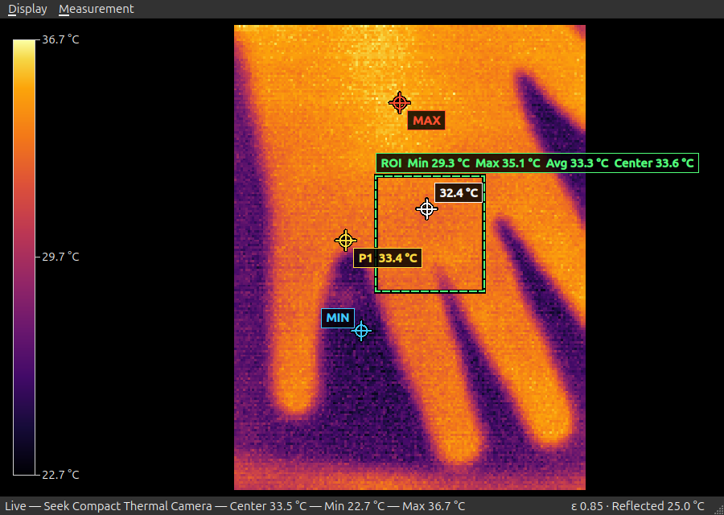

# ThermalSeek

ThermalSeek is a C++17 and Qt 6 desktop viewer for radiometric thermal
cameras. It discovers a supported USB camera, performs the camera-specific
calibration and temperature conversion, and displays a live colorized image
with minimum, maximum, and center temperatures in Celsius.

The project supports Seek Compact and Mileseey TR256i cameras on Linux.
Camera support is implemented in-tree; ThermalSeek does not build or link
libseekthermal or a proprietary camera SDK.



## Features

- Live capture on a dedicated worker thread.
- Camera-derived apparent temperatures with configurable emissivity and
  reflected-background compensation.
- Seek Compact detector fixed-pattern correction with a validated covered-lens
  calibration workflow and checksummed atomic profile storage.
- Five selectable thermal palettes with a matching temperature scale.
- Automatic, locked, and manually configured display temperature ranges.
- Live minimum, maximum, and center readings with hot/cold image markers.
- Mouse spot readings, pinned measurement points, and ROI statistics.
- Freeze-frame inspection while camera capture continues in the background.
- Resizable Qt Widgets interface.
- Single-key PNG screenshots containing the thermal view, scale, status,
  overlays, and active radiometric parameters.
- Camera selection, rescan, and reconnect without restarting the application.
- Direct libusb and Linux V4L2 capture with deterministic resource cleanup.

## Supported cameras

| Camera | USB ID | Status |
|---|---|---|
| Seek Compact / PIR206 | `289d:0010` | Live capture, radiometric temperatures, and fixed-pattern correction |
| Mileseey Tools TR256i | `0bda:5840` | Linux V4L2, 256×192 radiometric temperatures at 25 fps; learned FPN unavailable |

The first available camera opens automatically. Use **Camera → Select Camera**
to choose another, **F5** to rescan, or **Ctrl+R** to reconnect. Switching clears
the previous camera's frame, frozen state, and measurements.

See [CONTRIBUTING.md](CONTRIBUTING.md) before adding another model: transport,
calibration, frame layout, and conversion must remain model-specific.

### TR256i protocol and verification

Tested hardware reports `bcdDevice=13.03`, UVC 1.00. The Linux backend leaves
`uvcvideo` attached and negotiates YUYV 256×384, 512-byte stride, 196608 bytes
per frame, at 25 fps. The upper 98304 bytes are the camera's display image;
the lower 98304 bytes hold a native landscape 256×192 little-endian `uint16`
temperature field. Firmware supplies the calibrated values:

```text
Celsius = sample / 64 - 273.15
```

Complete frames consisting entirely of `0x8000` words are startup placeholders,
not temperatures. This camera produced 127 such frames (about five seconds)
after each stream start. A uniform temperature plane alone is not discarded.
Malformed frames and invalid samples (`0` or greater than `65000`) fail capture;
ThermalSeek never replaces them with plausible-looking temperatures.

The bridge uses USB vendor OUT `41/45`, value `0078`, index `9d00`:
`14 85 00 ID 00 00 00 00` queries a parameter, while
`14 c5 00 ID 00 00 HI LO` sets it. Both are followed by
`00 00 00 00 00 00 00 02` at index `1d08`. Vendor IN `c1/44`, value `0078`,
reads status at `0200` and the big-endian two-byte query reply at `1d10`.
Parameter 3 is emissivity Q7; parameter 4 is optical transmittance Q7.

Status `01` is busy; `00` confirms completion. Reading early can return the
previous command's reply. The backend polls every 10 ms with a 10-second
deadline: measured writes took about 1.05 seconds, and a query after stopping
during startup took 5.42 seconds. It temporarily sets camera emissivity to
`128/128`, verifies it, and restores the previous value on orderly/error close.
Host radiometric controls therefore do not apply emissivity twice. Optical
transmittance is preserved; no parameter-save/flash command is sent. Forced
termination or USB removal can prevent restoration; a restoration failure is
reported on stderr rather than silently ignored.

Protocol provenance: independently implemented facts from Mileseey Android
APK `3.07.46` (code `646`) and local USB captures. The ARM64
`libUVCCamera.so` SHA-256 is
`30a85d274d2ec148d81435ce611b905c64c40abb7e8f487b83b5d6d19977f0ab`.
With Ghidra image base `0x100000`, frame layout is established at `0x170874`,
temperature conversion at `0x186798`/`0x18c224`, parameter writes at `0x168398`,
and queries at `0x16cf38`/`0x169af8`. No decompiled source or SDK binary is
included in ThermalSeek.

Hardware verification covered 1501 valid frames at 25.003 fps without capture
timeouts, normal reopens, emissivity restoration with unchanged transmittance,
and the actual Qt viewer's selection, reconnect, measurements, display controls,
and PNG screenshots. Absolute accuracy against a reference target, cold USB
reconnection, and physical unplug during capture have not been verified.
Learned FPN is disabled because a factory-calibration fingerprint and reliable
shutter-completion telemetry have not been established for this model.

### Seek Compact regression verification

Tested hardware reports `bcdDevice=1.00`. The backend retains the Android
sequence's 10 ms interval after each 64-byte factory-data read and its 300 ms
pause after stopping capture, before releasing the USB interface. Immediate
teardown reproduced factory-read timeouts on warm reopens; with the stop
pause, 20 consecutive normal close/reopen cycles passed.

The sustained hardware check produced 412 valid display frames over 61.07
seconds, with 26 native shutter events and no capture timeouts. Raw and
FPN-corrected values had consistent dimensions, extrema, and center statistics.
The actual Qt viewer also passed three reconnects and a normal application
close/reopen, with portrait orientation and the existing FPN profile loaded.
Freeze, pinned points, ROI, live FPN enable/disable, and PNG screenshots were
verified; the existing profile remained unchanged. These are functional
regression checks, not absolute-temperature accuracy measurements.

## Requirements

- CMake 3.21 or newer
- C++17 compiler
- Qt 6.4 or newer with the Widgets component
- pkg-config
- libusb 1.0 development files
- Linux V4L2 and usbdevfs for the TR256i backend

On Ubuntu, the required development packages can be installed with:

```sh
sudo apt install build-essential cmake pkg-config qt6-base-dev libusb-1.0-0-dev
```

## Build

```sh
git clone ssh://git@git.teske.zip:30009/TeskesLabOrg/ThermalSeek.git
cd ThermalSeek
cmake -S . -B build -DCMAKE_BUILD_TYPE=Release
cmake --build build --parallel
```

Run the focused decoder, correction, display, and inspection tests with:

```sh
ctest --test-dir build --output-on-failure
```

Run the application with:

```sh
./build/thermalseek
```

The camera can take a short time to initialize and provide usable frames.
The viewer shows a waiting state until a radiometric frame is available;
TR256i normally needs about five seconds.

## Linux USB permissions

Seek Compact needs permission to claim its USB interface. TR256i needs
read/write access to its `/dev/video*` capture node and its `/dev/bus/usb/*/*`
device for emissivity controls; it does not detach or claim the UVC interface.
If access is denied, create a udev rule such as
`/etc/udev/rules.d/99-thermalseek.rules`:

```udev
SUBSYSTEM=="usb", ATTR{idVendor}=="289d", ATTR{idProduct}=="0010", MODE="0660", TAG+="uaccess"
SUBSYSTEM=="usb", ATTR{idVendor}=="0bda", ATTR{idProduct}=="5840", MODE="0660", TAG+="uaccess"
SUBSYSTEM=="video4linux", ATTRS{idVendor}=="0bda", ATTRS{idProduct}=="5840", MODE="0660", TAG+="uaccess"
```

Reload the rules and reconnect the camera:

```sh
sudo udevadm control --reload-rules
sudo udevadm trigger
```

Do not run the desktop application as root. `uaccess` grants access to active
desktop sessions; headless/SSH users need appropriate device-group permissions.

## Controls

| Key | Action |
|---|---|
| `F5` | Rescan supported cameras |
| `Ctrl+R` | Reconnect the selected camera |
| `P` | Cycle through thermal palettes |
| `A` | Use the automatic per-frame temperature range |
| `L` | Lock the currently displayed temperature range |
| `M` | Configure a manual temperature range |
| `H` | Toggle the hot and cold image markers |
| `R` | Configure emissivity and reflected-background temperature |
| `Space` | Freeze or resume the displayed thermal frame |
| `Delete` | Clear pinned points and the selected ROI |
| `G` | Save a screenshot of the ThermalSeek window |

The **Display** menu exposes the same palette, range, marker, freeze, and clear
controls. The **Measurement** menu contains radiometric settings plus
fixed-pattern calibration, enable/disable, and profile-deletion controls.

Move the mouse over the thermal image for an exact spot reading. Click to pin
a measurement point; click the same detector pixel again to remove it. Drag
with the left mouse button to select an ROI with minimum, maximum, average,
and center temperatures.

Radiometric correction defaults to emissivity `1.00`, which preserves the
camera's apparent temperatures exactly. For lower-emissivity targets, open
**Measurement → Radiometric Settings** and provide the target emissivity and
the reflected-background temperature. The corrected temperature field drives
the image, scale, MIN/MAX markers, spot readings, and ROI statistics. These
measurement settings, along with the palette, display range, markers, and
window geometry, persist between sessions.

On Seek Compact, learned fixed-pattern correction removes stable detector-local
temperature offsets before emissivity/reflected-background compensation.
To create a profile,
place the lens directly against a smooth, matte, room-temperature surface with
no gap, then choose **Measurement → Calibrate Fixed-Pattern Correction**. Keep
the camera covered and still while ThermalSeek collects 96 usable frames
spanning at least four shutter refreshes. Capture continues throughout the
modeless progress dialog.

ThermalSeek rejects calibration data with excessive target drift, spatial
non-uniformity, temporal noise, or detector bias. A valid profile is
zero-centered so it does not intentionally shift scene temperature, saved
atomically under the platform application-data directory, and keyed by a
SHA-256 fingerprint of that camera's factory calibration and device
information. Profiles are not portable between cameras. The permanent status
shows `FPN No profile`, `FPN Off`, `FPN On`, or calibration progress.
TR256i instead shows `FPN Unavailable`, with calibration, enable, and deletion
actions disabled. Its camera-reported temperatures and host radiometric
controls remain available.

Screenshots are written as PNG files to the platform Pictures directory under
a `ThermalSeek` subdirectory. The filename format is:

```text
ThermalSeek_yyyyMMdd_HHmmss_zzz.png
```

The status bar reports the saved path or the reason a screenshot failed.

## Architecture

```text
camera_session           selects one model-specific backend:
  Seek Compact: seek_compact_usb -> thermal_processor
  TR256i:       tr256i_camera (V4L2/USB) -> tr256i_decoder
       |
       v
ThermalFrame              immutable camera-apparent Celsius pixels
       |
       v
fixed_pattern_correction  optional learned detector bias subtraction (Seek)
       |
       v
ThermalFrame              corrected apparent Celsius pixels and statistics
       |
       v
radiometric_correction    emissivity and reflected-background compensation
       |
       v
ThermalFrame              measurement Celsius plus min/max/center and extrema
       |
       v
thermal_renderer          palette/range mapping plus all three frame stages
       |
       v
thermal_image_widget
       |                  display/detector mapping, spot points, ROI, overlays
       v
main_window               measurement controls, scale, status, screenshots
```

Important source files:

- `src/camera_session.*` — discovery, backend selection, and session capabilities.
- `src/thermal_frame.hpp` — common native-coordinate Celsius field and orientation.
- `src/seek_compact_usb.*` — direct libusb transport for `289d:0010`.
- `src/thermal_processor.*` — Seek Compact calibration and thermography.
- `src/tr256i_camera.*` — V4L2 transport and temporary camera-emissivity controls.
- `src/tr256i_decoder.*` — TR256i temperature plane, startup discrimination, and validation.
- `src/fixed_pattern_correction.*` — covered-lens profile training,
  validation, and detector-bias subtraction.
- `src/fixed_pattern_profile_store.*` — camera fingerprinting and atomic,
  checksummed profile persistence.
- `src/radiometric_correction.*` — emissivity/reflected-background
  compensation and corrected statistics.
- `src/camera_thread.*` — capture lifecycle, pooled frame ownership, and
  UI delivery.
- `src/thermal_palette.*` — selectable 256-color palette registry.
- `src/thermal_renderer.*` — display-range mapping and frame orientation.
- `src/thermal_inspection.*` — display/detector mapping and radiometric statistics.
- `src/thermal_image_widget.*` — mouse interaction and measurement overlays.
- `src/main_window.*` — live viewer, scale, controls, status, and screenshots.

## Contributing

Camera backends need hardware evidence, documented protocol provenance, safe
USB lifecycle handling, and a verified radiometric conversion. Read
[CONTRIBUTING.md](CONTRIBUTING.md) for the required design and validation
workflow.

## License

ThermalSeek source code is available under the [MIT License](LICENSE).

Qt and libusb are dynamically linked third-party dependencies with their own
licenses. Binary distributors remain responsible for the applicable Qt and
libusb license notices and relinking requirements.
